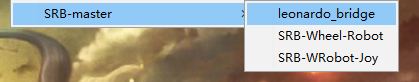
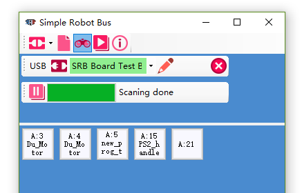
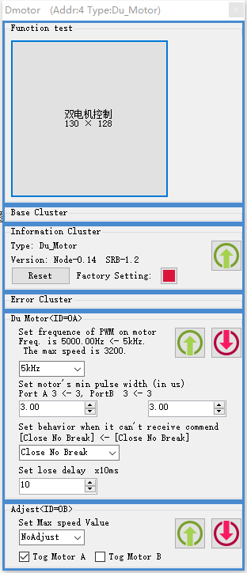

1.  首先组装好小车的机械和电路,装好电池
2.  将UART转SRB连接到Arduino板
3.  用USB烧写这个leonardo bridge 
  
5. 打开[/SRB_config](./SRB_config.zip),选好UART接口。
6. 接入电机模块,进行一次扫描,设置模块的地址。(可以设为4,跟4Arduino例程一样)
  
        (图中使用的是USB转SRB)
9. 接入手柄模块,进行一次扫描,设置模块的地址。(可以设为12)
10. 在电脑上可以试试模块是否好用。
11. 调整电机的旋转方向和运动参数: 
 
13. 注意调整后需要电机Reset按钮将电机复位后,调整才会生效。
14. 将电机的控制频率调整到5kHz。
15. 注意调整电机的旋转方向修正，需要的旋转方向和电机的接线有关，调整后使用功能测试模块进行测试，让控制参数全为正数时电机前进。
17.  烧写SRB-WRobot-Joy。(另一个Arduino例程)
18. 手柄操作机器人运动。
